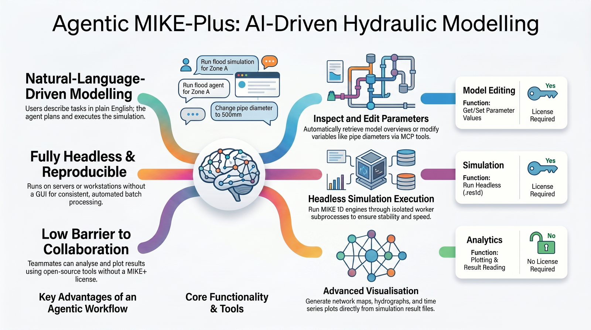
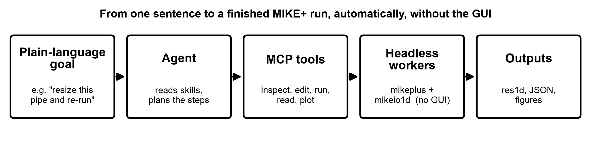
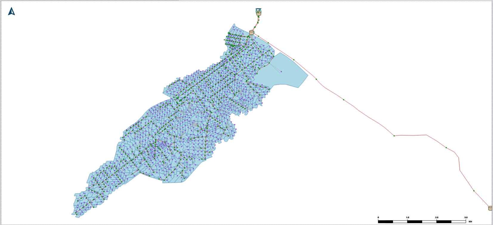
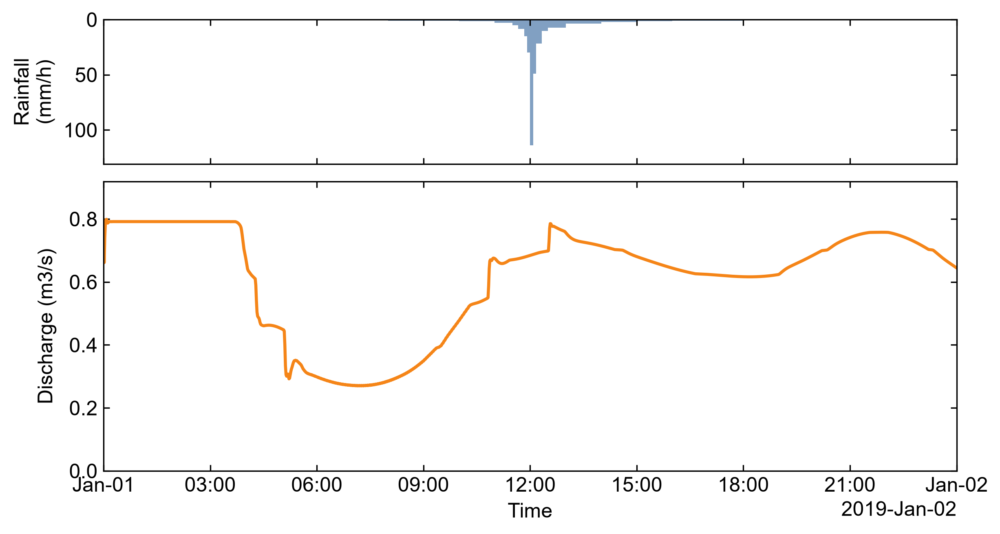

# Agentic MIKE+

**A headless, natural-language-driven, automated modelling workflow for MIKE+.**
**Skills + an MCP server** for [Claude Code](https://www.anthropic.com/claude-code), Codex, Hermes, or OpenClaw: describe a goal in plain language and the agent inspects, edits, runs, reads, and plots a MIKE+ model — automated modelling and analysis, end to end, without ever opening the GUI.

<p>
  <a href="https://github.com/Zhonghao1995/Agentic-MIKE-Plus/actions/workflows/ci.yml"></a>
  
  
  
  
  
</p>

> Experimental / pre-release. One MCP server + skills wrapping DHI's Python stack (`mikeplus` / `mikeio` / `mikeio1d`). Verified end to end on the MIKE+ 2026 `Sirius_RTC` example. Sibling of [agentic-swmm-workflow](https://github.com/Zhonghao1995/agentic-swmm-workflow).

## Install: just tell your agent

It is the AI era — you don't wire this up by hand. Paste this to your AI coding agent (Claude Code, Codex, Hermes, OpenClaw):

```text
Install "Agentic MIKE+" for me — an MCP server + skills to drive MIKE+ headless.

1. Clone https://github.com/Zhonghao1995/Agentic-MIKE-Plus and skim its README.
2. With Python 3.11 x64 (mikeplus needs 3.9-3.11, not 3.12+):
     py -3.11 -m venv .venv
     .venv\Scripts\python.exe -m pip install -r requirements.lock
     .venv\Scripts\python.exe -m pip install -e ".[run]"
   (read/plot only, no license: drop the lock and use `pip install -e .`)
3. Register with me — Claude Code:
     claude mcp add mike-plus -- "<abs-repo>\.venv\Scripts\python.exe" -m mikeplus_mcp.server
   (Codex / Hermes / OpenClaw: copy config/mcp.sample.json)
4. Copy skills/* into ~/.claude/skills/, then run scripts/smoke_test.py (should find 10 tools).
5. Tell me the tools and which need a MIKE+ license (run/edit do; read/plot don't).
```

Needs **Python 3.11 (x64)**. Two install profiles:

- **Read & plot** — license-free and cross-platform: `pip install -e .` (no `mikeplus`).
- **Run & edit too** — Windows + a licensed **MIKE+ 2026**: `pip install -e ".[run]"` (or `pip install -r requirements.lock` for the exact pinned environment).

`mikeplus` is an optional `[run]` extra, so teammates who only read results or make figures install nothing license-bound.

## Why it matters

- **Natural-language-driven.** Describe the task in plain words; the agent plans and runs it — no scripting, no GUI clicking. (A sub-agent did this autonomously.)
- **Fully headless.** Runs with no GUI — on a workstation, a server, in CI, or under an agent. Built for batch and scenario automation.
- **MCP-native and portable.** One server speaks the Model Context Protocol; works with **Claude Code, Codex, Hermes, or OpenClaw** via a single config line, and installs with pip.
- **Low barrier to share.** Reading results and plotting need no MIKE+ license — only running or editing does. Teammates analyse model output with nothing but `pip install`.
- **Reproducible & tested.** Deterministic tools, structured-JSON output, a pinned lockfile, and a license-free unit-test suite in CI — verified on a real model, not a chat-to-model black box.
- **Engine-agnostic and extensible.** Results use a common schema (ready to sit beside SWMM and LSTM); add a tool or skill by dropping in a file.

<p align="center">
  
</p>

## How it works

Skills (markdown playbooks) tell the agent *when and how*; the agent calls **MCP tools**; each tool runs in an isolated **worker subprocess** that imports only `mikeplus` *or* `mikeio*` — the two cannot share a process. The server itself imports neither.

```
agent  ->  reads skills/*.md  ->  calls MCP tools  ->  workers (mikeplus / mikeio1d)
```

<p align="center">
  
</p>

## Tools (one server, `mike-plus`)

| Tool | Does | License |
|---|---|---|
| `mike_model_info` | model overview: simulations, scenarios, element counts | yes |
| `mike_get_values` / `mike_set_values` | read / change parameters (e.g. pipe diameter) | yes |
| `mike_run` | run a simulation headless, return `.res1d` + a parsed QA status (completed / errors / warnings) | yes |
| `mike_results_list` / `summary` / `read` | list contents / peaks / one time series | no |
| `mike_plot_rain_flow` / `timeseries` / `network` | stacked hydrograph / series / network map | no |

Five skills (`mike-model`, `mike-params`, `mike-runner`, `mike-results`, `mike-plot`) orchestrate them.

**Install the skills** into any skills-aware agent (Claude Code, Codex, OpenCode, …) in one command — no clone needed:

```bash
npx skills add Zhonghao1995/Agentic-MIKE-Plus      # all 5 — add --list to preview, or --skill <name> for one
```

## Demo — `Sirius_RTC` (MIKE 1D, 568 nodes, 576 links)

<p align="center">
  
</p>
<p align="center">
  
</p>

Full evidence — commands, outputs, and the honest license boundary — is in **[docs/verification.md](docs/verification.md)**.

## Development

The engine-agnostic core is covered by a **license-free** test suite (no MIKE+ / `mikeplus` needed) that also runs in CI:

```bash
pip install -e .            # read/plot core (add ".[run]" for run/edit)
pip install pytest
pytest                      # ~0.5 s, no license required
```

The tests pin the result schema, the res1d column matcher, the engine-log QA parser, and tool discovery, so a change can't silently break them. Add a tool or skill by dropping a file under `mikeplus_mcp/tools/` or `skills/` (auto-discovered) — and ship a test with it.

## License

MIT © 2026 Zhonghao Zhang, University of Victoria. Built on DHI's `mikeplus` / `mikeio` / `mikeio1d` and the Model Context Protocol. MIKE+ is a product of DHI; running models requires a valid DHI license.
