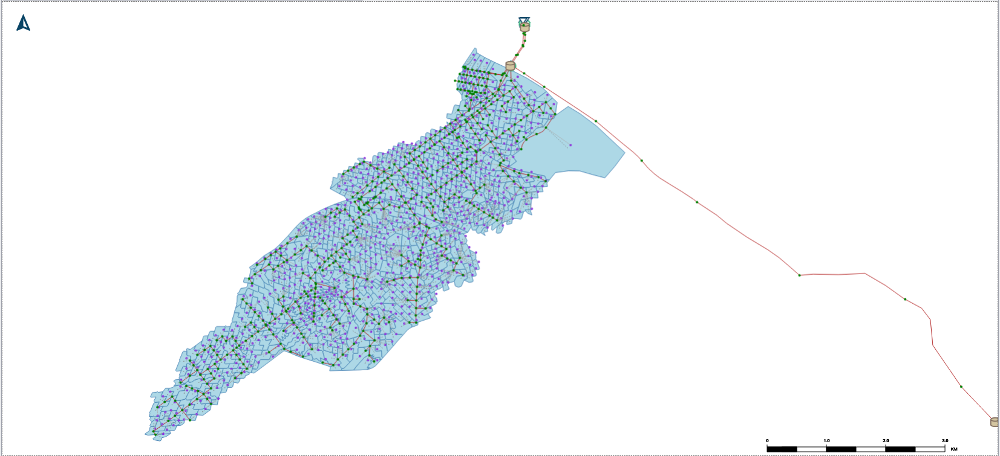
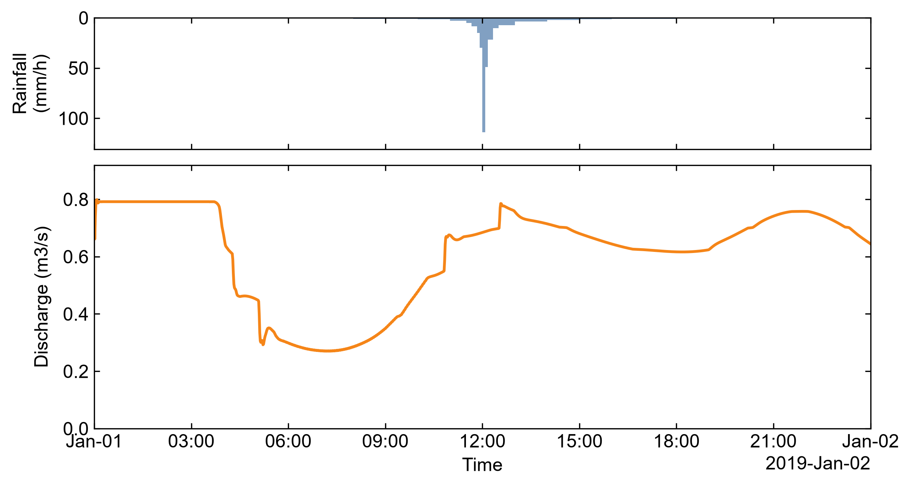

# Verification evidence

End-to-end evidence that the tools, skills, and the natural-language-driven loop
actually work, gathered on a real MIKE+ model. Reproduce with the pinned
environment (`requirements.lock`, Python 3.11 x64).

## Environment (pinned)

| Component | Version |
| --- | --- |
| Python | 3.11.9 (x64) |
| mcp | 1.28.0 |
| mikeplus | 2026.0.0 |
| mikeio | 3.1.0 |
| mikeio1d | 1.2.1 |
| pythonnet | 3.1.0 |
| pandas / numpy | 3.0.3 / 2.4.6 |
| matplotlib / shapely / scipy | 3.11.0 / 2.1.2 / 1.17.1 |
| MIKE+ (for run/edit only) | 2026 + valid DHI license |

## Tool discovery + smoke test

`python scripts/smoke_test.py` discovers all 18 tools and runs a live,
license-free read:

```
discovered tools: mike_get_values, mike_import_swmm, mike_manifest_write,
  mike_model_info, mike_plot_compare, mike_plot_network, mike_plot_profile,
  mike_plot_rain_flow, mike_plot_timeseries, mike_rain_to_dfs0,
  mike_results_compare, mike_results_flooding, mike_results_list,
  mike_results_read, mike_results_summary, mike_run, mike_set_scenario,
  mike_set_values
mike_results_list OK on Rainfall_CDS_1yearHDBaseDefault_Network_HD.res1d:
  quantities=['WaterLevel','Discharge','FlowVelocity','ControlStrategyId',
  'CrestLevel','DischargeInStructure','GateLevel']
SMOKE OK
```

The whole MCP server was also exercised over the real stdio transport
(`initialize` -> `list_tools` -> `call_tool`), returning the same results.

## End-to-end on the Sirius_RTC example

Sirius_RTC is a collection-system (MIKE 1D) model bundled with MIKE+:
**568 nodes, 576 links, 863 catchments**, with real-time-control rules and a
1-year CDS design storm. (Model files are DHI's and are not redistributed here —
see [examples/sirius_rtc](../examples/sirius_rtc/README.md).)

- **Inspect** — `mike_model_info`: active simulation `Rainfall_CDS_1yearHD`,
  scenario `Base`, model `CS_MIKE1D`, units `MU_CS_SI`.
- **Run (headless)** — `mike_run`: the MIKE 1D engine ran in ~44-59 s and
  returned a fresh `.res1d`. No GUI was opened.
- **Read results** — `mike_results_summary`:
  - WaterLevel peak **23.5221 m** at node `C14154801` (t = 19:31).
  - Discharge peak **0.7989 m3/s** at reach `Link_29` (t = 00:05, warm-up).
    With `skip_hours=6` the storm peak is **0.7852 m3/s** at `Link_29` (t = 12:34) —
    the option added after the sub-agent flagged the warm-up artifact (below).
- **Edit a parameter** — `mike_get_values` read `Diameter = 0.8 m` on reach
  `C14154801.2`; `mike_set_values` changed it to `0.2 m` and the change was
  **verified to persist** by read-back (the tool errors loudly if an edit does
  not take effect).

### Network layout and a rainfall-runoff hydrograph

Produced by `mike_plot_network` and `mike_plot_rain_flow` (license-free), in the
house style (Arial 12, ticks inward, SI units, no title):

<p align="center">
  
  
</p>

## Natural-language-driven validation

A general-purpose sub-agent was given only the tools, the `mike-results` and
`mike-plot` skills, and one sentence — *"tell me where the network is most
hydraulically stressed and plot the worst pipe."* With no hardcoded element ids,
it autonomously ran:

```
mike_results_list -> mike_results_summary -> mike_results_read -> mike_plot_rain_flow
```

found the worst reach (`Link_29`, 0.799 m3/s) and worst node (`C14154801`,
23.52 m), and produced the figure. It also reported a genuine issue — the global
discharge peak fell in the warm-up window (t = 00:05) rather than the storm — which
was folded back into `mike_results_summary` as the `skip_hours` option. This is
the build -> run -> critique -> improve loop working end to end.

## Round 3 (2026-08-15): compare, profile, flooding, rain, audit, scenario, import

All on the same Sirius_RTC copy; every number below is a tool return.

**License-free (mikeio1d / mikeio / pure Python)**

- `mike_results_compare` — single element `Discharge:Link_29` between the HD and
  RTC result files (`skip_hours=6`): 1081 aligned steps (`exact`), peak
  0.7852 -> 0.7921 m3/s (+0.88 %), peak 12 min earlier, volume 38 637 -> 51 305 m3
  (+32.8 %), RMSE 0.253, NSE(B vs A) -1.50. Ranked mode over all `WaterLevel`
  columns: 2439 shared, 5 only-A / 5 only-B, 2427 increased, 12 unchanged, top
  element `C21201401` (+9.12 m).
- `mike_results_flooding` (`skip_hours=6`): 564 nodes assessed (4 outlets
  skipped by default), 12 flooded (all type Manhole; among them the river-side
  `Node_27..31`, which carry a nominal 3-4.5 m ground level and a 100 m critical
  level and are reported as such), 4 above critical; worst `Node_27` peak
  13.83 m vs ground 3.30 m; closest dry node `Inflow to_WWTP_Basin`
  (freeboard 0.076 m).
- `mike_plot_compare` — overlay of the two runs for `Link_29` with the Sirius
  rain on top, house style, `png` written.
- `mike_plot_profile` — given chain `C14150802.2 -> C15154301.1` (5 reaches,
  825.5 m, 29 grid points, max WL 23.37 m, min freeboard 4.65 m) and an
  automatically found chain from `C14150802` to `Inflow to_WWTP_Basin` (100+
  reaches through the river branch); unknown node -> clear error.
- `mike_rain_to_dfs0` — 8-step intensity CSV -> `.dfs0` (item `Rainfall
  <Rainfall Intensity> (mm per hour) - MeanStepBackward`, 38.75 mm, peak
  110 mm/h) and the same storm as depth-per-step (`unit: mm`, converted, 38.7 mm);
  the file was then consumed by `mike_plot_rain_flow` as `rain_dfs0`.
- `mike_manifest_write` — manifest with the model copy (sha256), one existing +
  one missing input (`missing_files: ["nope.dfs0"]`), a result, a figure, the
  QA fields of a run dict (log tail dropped).

**License-gated (mikeplus), verified live on scratch copies**

- `mike_set_scenario` — activation persists across a re-open (`Base <->
  Upsized_pipes`), unknown name -> lists the available scenarios. Finding:
  a scenario created through mikeplus shares its parent's alternatives (an edit
  under it changed Base: 0.33 -> 0.5 m), and after giving it its own child
  alternatives `table.update()` silently wrote nothing (`mike_set_values`
  reported "did not persist"). Hence the tool activates existing scenarios only,
  and what-if variants are model copies (`mike-compare`).
- `mike_import_swmm` — EPA `Test_5_1.inp` and the agentic-swmm `todcreek`
  model import into new `.sqlite` files (`mss_Node`/`mss_Link`/`msm_Catchment`
  populated, model type switched to `CS_SWMM`, `mike_model_info` then reports
  the `mss_*` counts and the imported setup as active). Two importer facts were
  isolated by bisection: an `[OUTFALLS]` row without the `Gated` column fails
  the import (the tool now imports a patched copy and reports it), and with no
  license checked out (demo mode) any `.inp` with more than 10 subcatchments
  fails (10 pass, 11 fail, reproducibly); `tecnopolo` (40 subcatchments)
  therefore failed on this seat and the tool's error says why. Running an
  imported SWMM-type model through `mike_run` was not exercised (license).

## License boundary (honest)

`mike_run` and the parameter edits each work individually, but the local MIKE+
license is **single-seat / floating**: the engine feature is contended with the
GUI and effectively rate-limited (about one engine checkout before it needs to
recover). A back-to-back baseline+scenario run on a single seat is therefore not
reliable, so multi-run workflows (calibration, uncertainty) need a multi-seat or
dedicated engine/SDK license. Reading results and plotting need no license at
all. This is an environment/licensing constraint, not a limitation of the code.

## Reproduce

```powershell
py -3.11 -m venv .venv
.\.venv\Scripts\python.exe -m pip install -r requirements.lock
.\.venv\Scripts\python.exe -m pip install -e ".[run]"   # read/plot only: drop the lock and use `-e .`
.\.venv\Scripts\python.exe scripts\smoke_test.py
# then point the mike_* tools at a MIKE+ model (a working copy of Sirius_RTC, etc.)
```
